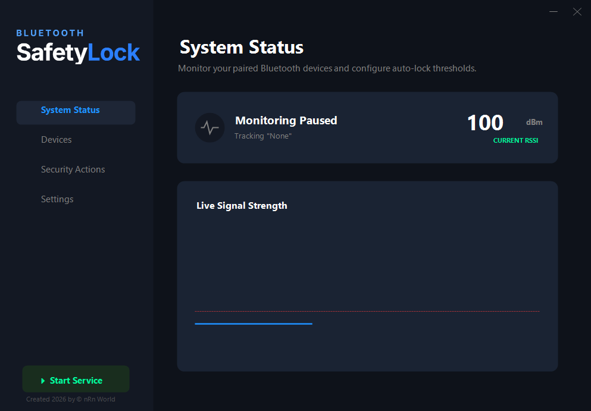
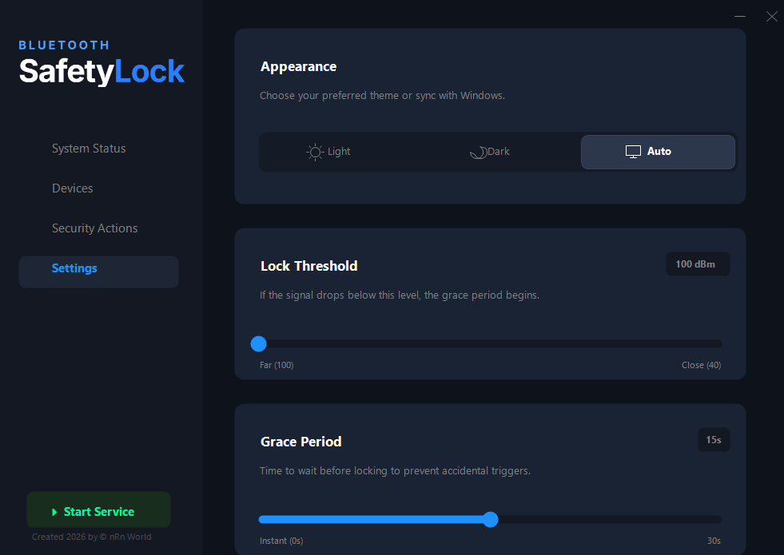

# 🔒 BluetoothSafetyLock

**A sophisticated, modern Bluetooth-based security solution for Windows.**

BluetoothSafetyLock is a premium security tool designed to protect your workstation by automatically locking your PC when your paired Bluetooth device (smartphone, smartwatch, or headphones) moves out of range. It features a sleek, modern UI with real-time signal monitoring and customizable security actions.

---

## 📸 Screenshots

### 🚀 Getting Started
The main dashboard provides a clear overview of your system status and real-time signal strength.

### 📱 Device Management
Easily scan and pair your preferred Bluetooth devices for monitoring.

### 🛡️ Security Actions
Configure exactly what happens when you leave. Lock the workstation, clear the clipboard, or auto-unlock when you return.

### ⚙️ Customization
Personalize the experience with Light, Dark, and Auto themes, and fine-tune the locking sensitivity.

---

## ✨ Key Features

- **Real-time Signal Tracking**: Visual graph showing the RSSI (signal strength) of your monitored device.
- **Connection-Based Locking**: Locking only arms after Windows confirms an active Bluetooth connection to your paired device. Devices that merely broadcast a signal nearby — like a neighbour's phone — can never trigger a lock.
- **Grace Period**: Prevent accidental locks with a configurable waiting period.
- **Filtered Signal**: Raw Bluetooth signal is smoothed and hysteresis is applied, so the app doesn't lock on normal signal jitter.
- **Persistent Settings**: All your settings and your selected device are saved locally and restored automatically at next start. No cloud, no accounts, no telemetry — everything stays on your machine.
- **Single Instance**: Only one copy of the app can run at a time, so it never double-locks or double-polls.
- **Built-in Auto-Updates**: The app checks GitHub Releases for new versions (shortly after launch and every 6 hours), downloads them in the background and installs them on the next start — with balloon notifications and an on-demand "Check for updates" option. Can be switched off in Settings.
- **Wake Screen on Approach**: Wakes your screen when you return so you can log back in quickly. (Windows does not allow apps to unlock a locked session — you always authenticate yourself. This is by design in the operating system.)
- **Clipboard Security**: Automatically clears your clipboard upon locking for extra privacy.
- **Modern UI**: A beautiful, high-performance interface with support for Light and Dark modes.
- **Silent Operation**: Runs quietly in the system tray with quick-access controls.

---

## 🛠️ Installation & Usage

1. **Download**: Go to the [Releases](https://github.com/nRn-World/BluetoothSafetyLock/releases) page and download the latest `BluetoothSafetyLock-v1.0.zip`.
2. **Extract**: Unzip the folder to a location of your choice on your computer.
3. **Run**: Launch `BluetoothSafetyLock.exe`. It's a self-contained app, so no installation is required!
4. **Pair**: Open the app, go to the "Devices" tab, click "+ Add Device", and select your Bluetooth device.
5. **Configure**: Fine-tune your "Lock Threshold" and "Grace Period" in the "Settings" tab to fit your needs.
6. **Protect**: Ensure the service is started (click "Start Service" in the sidebar). Your PC is now secured!
7. **Keep it running**: When "Launch at Startup" is enabled, the app starts automatically with Windows and resumes monitoring your last selected device — protection is on from boot without any extra steps.

### 📁 Where are my settings stored?

All settings are stored locally in `%APPDATA%\BluetoothSafetyLock\settings.json`, and logs in `%APPDATA%\BluetoothSafetyLock\logs\`. The app makes no network connections other than the optional update check against GitHub Releases and the Bluetooth devices you monitor.

---

## ⚖️ License

**nRn World Non-Commercial License**  
Copyright (c) 2026 nRn World

- **Individuals & Education**: Free for private, non-commercial use.
- **Commercial Use**: Requires a separate commercial license.
- **Contact**: bynrnworld@gmail.com

---

☕ **Support development**: [Buy me a coffee 💜](https://ko-fi.com/nrnworld)

Created by ❤️ © nRn World
